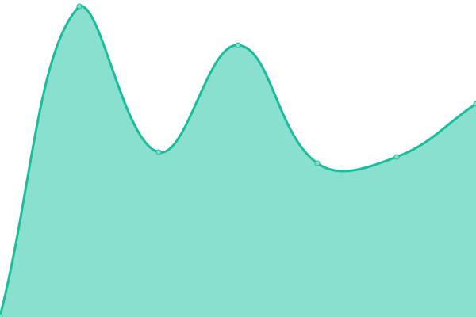
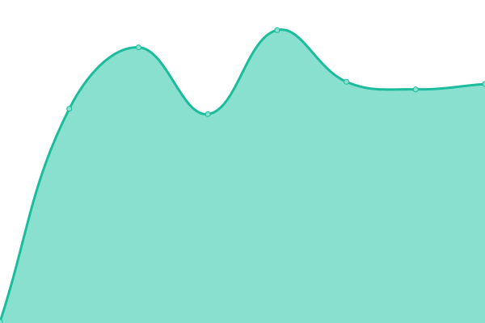
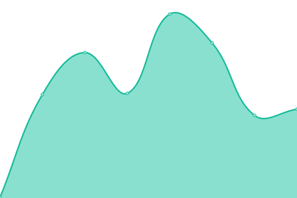
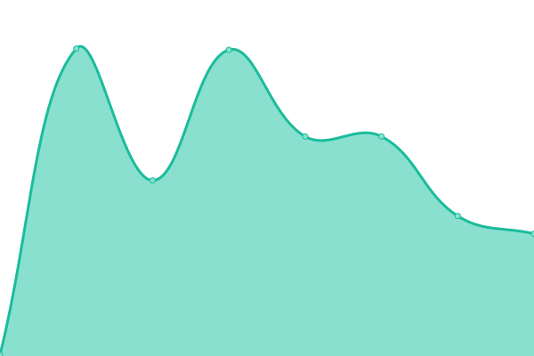
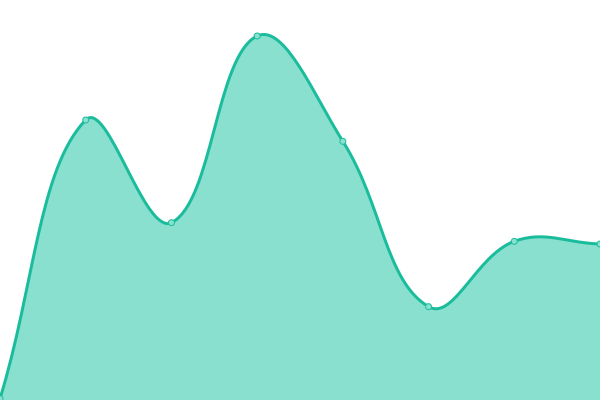
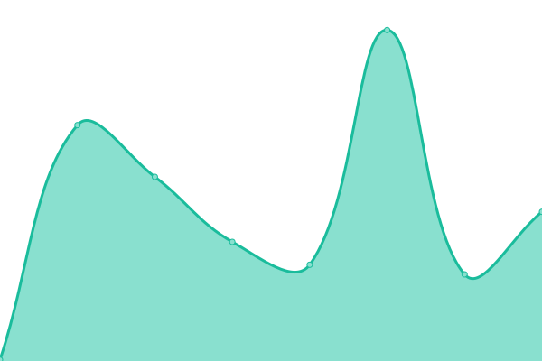

# [📈 Live Status](https://upptime.voxel51.com): <!--live status--> **🟧 Partial outage**

This repository contains the open-source uptime monitor and status page for [Voxel51](https://voxel51.com), powered by [Upptime](https://github.com/upptime/upptime).

With [Upptime](https://upptime.js.org), you can get your own unlimited and free uptime monitor and status page, powered entirely by a GitHub repository. We use [Issues](https://github.com/voxel51/upptime/issues) as incident reports, [Actions](https://github.com/voxel51/upptime/actions) as uptime monitors, and [Pages](https://upptime.voxel51.com) for the status page.

<!--start: status pages-->
<!-- This summary is generated by Upptime (https://github.com/upptime/upptime) -->
<!-- Do not edit this manually, your changes will be overwritten -->
<!-- prettier-ignore -->
| URL | Status | History | Response Time | Uptime |
| --- | ------ | ------- | ------------- | ------ |
|  [demo.fiftyone.ai](https://demo.fiftyone.ai/api/hello) | 🟩 Up | [demo-fiftyone-ai.yml](https://github.com/voxel51/upptime/commits/HEAD/history/demo-fiftyone-ai.yml) | 

 266ms
     
 | 

<a href="https://upptime.voxel51.com/history/demo-fiftyone-ai">100.00%</a>
    

|  [dev.fiftyone.ai](https://dev.fiftyone.ai/api/hello) | 🟩 Up | [dev-fiftyone-ai.yml](https://github.com/voxel51/upptime/commits/HEAD/history/dev-fiftyone-ai.yml) | 

 230ms
     
 | 

<a href="https://upptime.voxel51.com/history/dev-fiftyone-ai">100.00%</a>
    

|  [docs.voxel51.com](https://docs.voxel51.com) | 🟩 Up | [docs-voxel51-com.yml](https://github.com/voxel51/upptime/commits/HEAD/history/docs-voxel51-com.yml) | 

 164ms
     
 | 

<a href="https://upptime.voxel51.com/history/docs-voxel51-com">100.00%</a>
    

|  [fiftyone.ai](https://fiftyone.ai) | 🟩 Up | [fiftyone-ai.yml](https://github.com/voxel51/upptime/commits/HEAD/history/fiftyone-ai.yml) | 

 133ms
     
 | 

<a href="https://upptime.voxel51.com/history/fiftyone-ai">100.00%</a>
    

|  [pypi.fiftyone.ai](https://pypi.fiftyone.ai) | 🟩 Up | [pypi-fiftyone-ai.yml](https://github.com/voxel51/upptime/commits/HEAD/history/pypi-fiftyone-ai.yml) | 

 152ms
     
 | 

<a href="https://upptime.voxel51.com/history/pypi-fiftyone-ai">100.00%</a>
    

|  [pypi.voxel51.com](https://pypi.voxel51.com) | 🟥 Down | [pypi-voxel51-com.yml](https://github.com/voxel51/upptime/commits/HEAD/history/pypi-voxel51-com.yml) | 

 0ms
     
 | 

<a href="https://upptime.voxel51.com/history/pypi-voxel51-com">0.00%</a>
    

|  [staging.rc.fiftyone.ai](https://staging.rc.fiftyone.ai/api/hello) | 🟩 Up | [staging-rc-fiftyone-ai.yml](https://github.com/voxel51/upptime/commits/HEAD/history/staging-rc-fiftyone-ai.yml) | 

 251ms
     
 | 

<a href="https://upptime.voxel51.com/history/staging-rc-fiftyone-ai">100.00%</a>
    

|  [try.fiftyone.ai](https://try.fiftyone.ai/api/hello) | 🟩 Up | [try-fiftyone-ai.yml](https://github.com/voxel51/upptime/commits/HEAD/history/try-fiftyone-ai.yml) | 

 213ms
     
 | 

<a href="https://upptime.voxel51.com/history/try-fiftyone-ai">100.00%</a>
    

|  [voxel51.com](https://voxel51.com) | 🟩 Up | [voxel51-com.yml](https://github.com/voxel51/upptime/commits/HEAD/history/voxel51-com.yml) | 

 440ms
     
 | 

<a href="https://upptime.voxel51.com/history/voxel51-com">96.98%</a>
    

|  [voxel51.fiftyone.ai](https://voxel51.fiftyone.ai) | 🟥 Down | [voxel51-fiftyone-ai.yml](https://github.com/voxel51/upptime/commits/HEAD/history/voxel51-fiftyone-ai.yml) | 

 0ms
     
 | 

<a href="https://upptime.voxel51.com/history/voxel51-fiftyone-ai">0.00%</a>
    

|  [www.voxel51.com](http://www.voxel51.com) | 🟩 Up | [www-voxel51-com.yml](https://github.com/voxel51/upptime/commits/HEAD/history/www-voxel51-com.yml) | 

 594ms
     
 | 

<a href="https://upptime.voxel51.com/history/www-voxel51-com">96.98%</a>
    

|  VoxelGPT-Dev | 🟩 Up | [voxel-gpt-dev.yml](https://github.com/voxel51/upptime/commits/HEAD/history/voxel-gpt-dev.yml) | 

 183ms
     
 | 

<a href="https://upptime.voxel51.com/history/voxel-gpt-dev">100.00%</a>
    

|  VoxelGPT | 🟩 Up | [voxel-gpt.yml](https://github.com/voxel51/upptime/commits/HEAD/history/voxel-gpt.yml) | 

 135ms
     
 | 

<a href="https://upptime.voxel51.com/history/voxel-gpt">100.00%</a>
    

<!--end: status pages-->

[**Visit our status website →**](https://upptime.voxel51.com)

## 📄 License

- Powered by: [Upptime](https://github.com/upptime/upptime)
- Code: [MIT](./LICENSE) © [Voxel51](https://voxel51.com)
- Data in the `./history` directory: [Open Database License](https://opendatacommons.org/licenses/odbl/1-0/)
